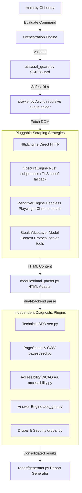

#  Stealth Lightbeacon

[](https://github.com/pratik-saptarshi/stealth-lightbeacon)
[](https://github.com/pratik-saptarshi/stealth-lightbeacon)
[](LICENSE)
[](pyproject.toml)

An enterprise-grade, high-performance asynchronous diagnostic audit tool and crawler for Drupal and PHP sites, checking technical compliance, security governance, accessibility, and modern search engine optimization categories. It also exposes agent-friendly report formats and CI contracts for orchestration workflows. This release train is aligned to `v1.2.3`.

---

## Documentation

- [CLI Reference](CLI-readme.md)
- [Architecture Guide](docs/architecture.md)
- [Changelog](changelog.md) — current release `v1.2.3`
- [Chagelog](chagelog.md) — alias entry for the same release history
- [Contributing Guide](CONTRIBUTING.md)

---

## 🏗️ Architecture & Engine Workflows

The system is designed as a decoupled, concurrent **asynchronous plugin framework** in Python. A central crawler and orchestrator fetches pages recursively in parallel, feeding the static DOM structures to independent evaluation plugins. For full developer deep dives, see the [Architecture Guide](docs/architecture.md).



Operational controls extend the main crawl/evaluate loop:

- `--recon` runs advisory anti-bot reconnaissance before the audit.
- `--recon-auto` applies the recon-recommended scraping posture automatically.
- Selector repair in `utils/selector_resolver.py` is scoped per parser instance and recovers from minor layout shifts during parsing without leaking nodes across documents.
- `utils/crawl_diff.py` compares canonical saved reports and runs to surface regressions and improvements.
- `utils/ontology.py` buffers semantic-store writes during the crawl and flushes them in batches to keep the hot path lighter.
- `utils/agent_card.py` publishes a stable manifest for orchestration consumers.
- Normalized report payloads (`target_url`, `average_score`, `total_issues`, `domains`) are now reused by all report renderers (`json`, `html`, `llm`, `geo-xml`).

---

## 🕵️ Adversarial Scraping Tier

To execute security and compliance playbooks against sophisticated web properties, the auditing workloads segment across four specialized scraping strategies:

1. **HTTP Engine:** Lightweight, high-concurrency standard HTTP asynchronous fetches.
2. **Obscura Engine (Fast-Path):** Executes an external compiled static Rust binary (`bin/obscura`) via non-blocking subprocesses, falling back to customized browser TLS fingerprints and HTTP/2 profiles if the binary is absent.
3. **Zendriver Engine (Heavy-Path):** Headless, anti-detect Chrome process. Overrides automation headers, emulates authentic plugin configurations, spoofs GPU/Canvas WebGL renderers, and mimics human mouse actions to bypass zero-day bot detection rules.
4. **Stealth Browser MCP:** Protocol client layer wrapping scraping payloads into standardized Model Context Protocol tool requests (e.g. Playwright stdio integrations) for autonomous agents.
   - Requires an explicitly pinned executable or versioned package via `SLB_MCP_COMMAND` / `SLB_MCP_ARGS`.
   - The mutable runtime-download default is disabled so audit behavior stays deterministic.

---

## 🛠️ devContainer Sandbox Environment

The repository is fully pre-configured for instant containerized development in standard **VS Code devContainers**:

- **System-level Isolation:** Eliminates host machine configuration drift.
- **Pre-installed System Libraries:** Automatically provisions system dependencies required for Chromium browser rendering (`libnss3`, `libasound2`, `libgtk-3`, etc.).
- **Automatic Setup Hook:** Executes `.devcontainer/post-create.sh` on container boot to install packages in `requirements.txt` and download Chromium browser binaries automatically.

To launch in VS Code:
1. Ensure Docker and the **Dev Containers** VS Code extension are installed.
2. Open the project root folder in VS Code.
3. Click the green indicator in the bottom-left corner and select **Reopen in Container**.

---

## 📦 Manual Installation & Setup

If you prefer to install dependencies directly on the host machine:

1. **Create and activate Virtual Environment:**
   ```bash
   python3 -m venv .venv
   source .venv/bin/activate
   ```
2. **Install core requirements:**
   ```bash
   pip install -r requirements.txt --extra-index-url https://pypi.org/simple
   ```
3. **Validate pinned dependencies before merge:**
   ```bash
   python -m pip install pip-tools
   pre-commit install
   pre-commit run dependency-validation --all-files
   ```
4. **Install optional browser rendering dependencies (Playwright):**
   ```bash
   pip install playwright
   playwright install chromium
   ```
5. **Setup environment variables:**
    ```bash
    cp .env.example .env
    # Add your Google PageSpeed Insights API Key to .env
    ```
   Optional MCP pinning variables:
   - `SLB_MCP_COMMAND`
   - `SLB_MCP_ARGS`
   - `SLB_MCP_HANDSHAKE_TIMEOUT`
   - `SLB_MCP_TOOL_TIMEOUT`
   - `SLB_MCP_SHUTDOWN_TIMEOUT`

---

## 🚀 CLI Usage Guide

Execute automated site evaluations using simple commands:

```bash
# Basic evaluation of a single URL
python main.py evaluate "https://example.com"

# Crawl pages recursively up to depth 2 (circuit-breaker limit of 10 pages)
python main.py evaluate "https://example.com" --crawl-depth 2 --max-urls 10

# Generate specific report formats (json, html, both [default], llm, or geo-xml)
python main.py evaluate "https://example.com" --format html
python main.py evaluate "https://example.com" --format llm
python main.py evaluate "https://example.com" --format geo-xml

# Execute rendered DOM checks using headless anti-detect Chrome
python main.py evaluate "https://example.com" --render

# Run only a subset of evaluators and fail on critical findings
python main.py evaluate "https://example.com" --audits security,performance --fail-on-critical

# Select a specialized adversarial scraping engine
python main.py evaluate "https://example.com" --engine stealth

# Inspect the target with advisory reconnaissance before selecting a posture
python main.py evaluate "https://example.com" --recon --recon-auto
```

### Public Audit Wrapper

Use the checked-in wrapper for a public audit profile:

```bash
./scripts/run_public_audit.sh
TARGET=www.example.com ./scripts/run_public_audit.sh
TARGET=www.example.com OUT_DIR=reports/custom/example.com ENGINE=stealth CRAWL_DEPTH=2 MAX_URLS=250 ./scripts/run_public_audit.sh
```

The wrapper defaults to `https://www.example.com`, normalizes bare targets such as `www.example.com` to HTTPS, and passes the target straight through to the audit CLI. Use `PYTHON=...` when you need a different interpreter.

### Command Line Options

| Argument / Option | Default | Description |
|---|---|---|
| `URL` (Argument) | *Required* | Target URL of the Drupal site to scan. |
| `--out`, `-o` | `reports/` | Custom output folder path for generated report artifacts. |
| `--format`, `-f` | `both` | Report format selection: `json`, `html`, `both`, `llm`, or `geo-xml`. |
| `--audits` | *unset* | Optional comma-separated evaluator subset such as `security,performance`. |
| `--fail-on-critical` | `False` | Exit with code 1 when any critical issue is present. |
| `--allow-private` | `False` | Permits audits of loopback or private ranges (disables SSRF guard). |
| `--crawl-depth`, `-d` | `0` | Max recursion depth for discovery crawling (0 = target URL only). |
| `--max-urls`, `-n` | `10` | Max page count circuit-breaker boundary during crawling. |
| `--render` | `False` | Run rendered-mode javascript audits via Playwright. |
| `--engine` | `http` | Pluggable scraper strategy: `http`, `fast` (Obscura), `stealth` (Zendriver), or `mcp`. |
| `--recon` | `False` | Run advisory reconnaissance before the crawl. |
| `--recon-auto` | `False` | Apply the recon-recommended scraper posture automatically. |
| `--http2` | `False` | Enable HTTP/2 connections. |
| `--budget` | `None` | Path to JSON config specifying strict Core Web Vitals performance budgets. |
| `--check-links` | `False` | Performs concurrent HTTP status validations on all outbound/same-domain links. |
| `--check-api` | `False` | Asynchronously audits default Drupal REST & JSON:API directories for sensitive exposures. |
| `--persist` | `False` | Persist audit runs, pages, and findings for historical lookup and diffing. |

### CI and Environment Variables

The CLI also accepts environment-backed inputs for CI pipelines:

- `SLB_TARGET_URL`: default target URL when the CLI is run without a positional argument.
- `SLB_AUTH_TOKEN`: bearer token passed through to authenticated CI runs.
- `SLB_AUDITS`: comma-separated evaluator subset used by CI recipes.
- `SLB_FAIL_ON_CRITICAL`: fail the job when any critical finding is detected.
- `SLB_MCP_COMMAND`: pinned executable path when using `--engine mcp`.
- `SLB_MCP_ARGS`: additional args for the pinned MCP command.
- `SLB_MCP_HANDSHAKE_TIMEOUT`: timeout in seconds for the MCP handshake.
- `SLB_MCP_TOOL_TIMEOUT`: timeout in seconds for MCP tool calls and I/O drains.
- `SLB_MCP_SHUTDOWN_TIMEOUT`: timeout in seconds for MCP process shutdown.

Checked-in recipe templates live under `ci-recipes/` for GitHub Actions, GitLab CI, and Bitbucket Pipelines, and they treat those variables as the CI contract.

---

## 🧪 Testing Suite & Quality Boundaries

We enforce coverage gates with `pytest-cov` and branch tracking, with the current minimum overall coverage floor set in `pyproject.toml`.

Run the full automated test suite:
```bash
# Run tests with verbose output
pytest -v

# Run coverage audit reports
pytest --cov=modules --cov=crawler --cov=utils --cov-report=html
```

Current CI validates the suite on Python 3.11 with dependency resolution checks against live PyPI indexes before tests run.

## 📄 Output Artifacts

- JSON reports are written to `reports/report.json` unless `--out` overrides the directory.
- HTML reports are written to `reports/report.html` unless `--out` overrides the directory.
- LLM-ready Markdown reports are written to `reports/report.md` unless `--out` overrides the directory.
- GEO XML reports are written to `reports/report.xml` unless `--out` overrides the directory.
- Console output includes a domain score table and a detailed issue log.

---

## 📄 License & Staging Safeguards

- **License:** Licensed under the [MIT License](LICENSE) (open and free for commercial and private redistribution).
- **Contribution Policy:** We follow Test-Driven Development (TDD) guidelines. See [CONTRIBUTING.md](CONTRIBUTING.md) before opening pull requests.
- **Vulnerability Policy:** For security issues, private disclosure pathways are configured. Review [SECURITY.md](SECURITY.md) before submitting vulnerability reports.
