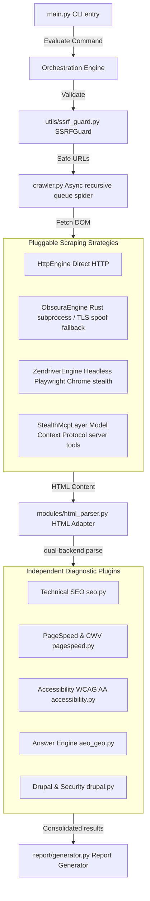

#  Stealth Lightbeacon

[](https://github.com/pratik-saptarshi/stealth-lightbeacon)
[](https://github.com/pratik-saptarshi/stealth-lightbeacon)
[](LICENSE)
[](pyproject.toml)

An enterprise-grade, high-performance asynchronous diagnostic audit tool and crawler for Drupal and PHP sites, checking technical compliance, security governance, accessibility, and modern search engine optimization categories.

---

## Documentation

- [CLI Reference](CLI-readme.md)
- [Architecture Guide](docs/architecture.md)
- [Changelog](changelog.md)
- [Contributing Guide](CONTRIBUTING.md)

---

## 🏗️ Architecture & Engine Workflows

The system is designed as a decoupled, concurrent **asynchronous plugin framework** in Python. A central crawler and orchestrator fetches pages recursively in parallel, feeding the static DOM structures to independent evaluation plugins. For full developer deep dives, see the [Architecture Guide](docs/architecture.md).



---

## 🕵️ Adversarial Scraping Tier

To execute security and compliance playbooks against sophisticated web properties, the auditing workloads segment across four specialized scraping strategies:

1. **HTTP Engine:** Lightweight, high-concurrency standard HTTP asynchronous fetches.
2. **Obscura Engine (Fast-Path):** Executes an external compiled static Rust binary (`bin/obscura`) via non-blocking subprocesses, falling back to customized browser TLS fingerprints and HTTP/2 profiles if the binary is absent.
3. **Zendriver Engine (Heavy-Path):** Headless, anti-detect Chrome process. Overrides automation headers, emulates authentic plugin configurations, spoofs GPU/Canvas WebGL renderers, and mimics human mouse actions to bypass zero-day bot detection rules.
4. **Stealth Browser MCP:** Protocol client layer wrapping scraping payloads into standardized Model Context Protocol tool requests (e.g. Playwright stdio integrations) for autonomous agents.

---

## 🛠️ devContainer Sandbox Environment

The repository is fully pre-configured for instant containerized development in standard **VS Code devContainers**:

- **System-level Isolation:** Eliminates host machine configuration drift.
- **Pre-installed System Libraries:** Automatically provisions system dependencies required for Chromium browser rendering (`libnss3`, `libasound2`, `libgtk-3`, etc.).
- **Automatic Setup Hook:** Executes `.devcontainer/post-create.sh` on container boot to install packages in `requirements.txt` and download Chromium browser binaries automatically.

To launch in VS Code:
1. Ensure Docker and the **Dev Containers** VS Code extension are installed.
2. Open the project root folder in VS Code.
3. Click the green indicator in the bottom-left corner and select **Reopen in Container**.

---

## 📦 Manual Installation & Setup

If you prefer to install dependencies directly on the host machine:

1. **Create and activate Virtual Environment:**
   ```bash
   python3 -m venv .venv
   source .venv/bin/activate
   ```
2. **Install core requirements:**
   ```bash
   pip install -r requirements.txt --extra-index-url https://pypi.org/simple
   ```
3. **Validate pinned dependencies before merge:**
   ```bash
   python -m pip install pip-tools
   pre-commit install
   pre-commit run dependency-validation --all-files
   ```
4. **Install optional browser rendering dependencies (Playwright):**
   ```bash
   pip install playwright
   playwright install chromium
   ```
5. **Setup environment variables:**
   ```bash
   cp .env.example .env
   # Add your Google PageSpeed Insights API Key to .env
   ```

---

## 🚀 CLI Usage Guide

Execute automated site evaluations using simple commands:

```bash
# Basic evaluation of a single URL
python main.py evaluate "https://example.com"

# Crawl pages recursively up to depth 2 (circuit-breaker limit of 10 pages)
python main.py evaluate "https://example.com" --crawl-depth 2 --max-urls 10

# Generate specific report formats (json, html, or both [default])
python main.py evaluate "https://example.com" --format html

# Execute rendered DOM checks using headless anti-detect Chrome
python main.py evaluate "https://example.com" --render

# Select a specialized adversarial scraping engine
python main.py evaluate "https://example.com" --engine stealth
```

### Command Line Options

| Argument / Option | Default | Description |
|---|---|---|
| `URL` (Argument) | *Required* | Target URL of the Drupal site to scan. |
| `--out`, `-o` | `reports/` | Custom output folder path for JSON and HTML reports. |
| `--format`, `-f` | `both` | Report format selection: `json`, `html`, or `both`. |
| `--allow-private` | `False` | Permits audits of loopback or private ranges (disables SSRF guard). |
| `--crawl-depth`, `-d` | `0` | Max recursion depth for discovery crawling (0 = target URL only). |
| `--max-urls`, `-n` | `10` | Max page count circuit-breaker boundary during crawling. |
| `--render` | `False` | Run rendered-mode javascript audits via Playwright. |
| `--engine` | `http` | Pluggable scraper strategy: `http`, `fast` (Obscura), `stealth` (Zendriver), or `mcp`. |
| `--http2` | `False` | Enable HTTP/2 connections. |
| `--budget` | `None` | Path to JSON config specifying strict Core Web Vitals performance budgets. |
| `--check-links` | `False` | Performs concurrent HTTP status validations on all outbound/same-domain links. |
| `--check-api` | `False` | Asynchronously audits default Drupal REST & JSON:API directories for sensitive exposures. |

---

## 🧪 Testing Suite & Quality Boundaries

We enforce coverage gates with `pytest-cov` and branch tracking, with the current minimum overall coverage floor set in `pyproject.toml`.

Run the full automated test suite:
```bash
# Run tests with verbose output
pytest -v

# Run coverage audit reports
pytest --cov=modules --cov=crawler --cov=utils --cov-report=html
```

Current CI validates the suite on Python 3.11 with dependency resolution checks against live PyPI indexes before tests run.

---

## 📄 License & Staging Safeguards

- **License:** Licensed under the [MIT License](LICENSE) (open and free for commercial and private redistribution).
- **Contribution Policy:** We follow Test-Driven Development (TDD) guidelines. See [CONTRIBUTING.md](CONTRIBUTING.md) before opening pull requests.
- **Vulnerability Policy:** For security issues, private disclosure pathways are configured. Review [SECURITY.md](SECURITY.md) before submitting vulnerability reports.
